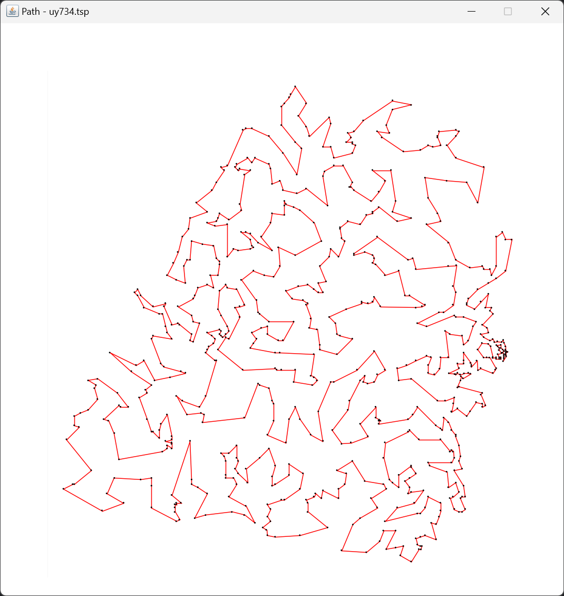

# Solving the Travelling Salesman Problem with an Enhanced Nearest Neighbour Algorithm
## 1. Introduction
The Travelling Salesman Problem (TSP) is a classic optimisation problem that involves finding the shortest possible route that visits a set of locations exactly once and returns to the starting point. This project implements an enhanced version of the Nearest Neighbour algorithm to solve the TSP. This application allows users to upload a file containing locations and compute the shortest path using this algorithm, displaying the result both as text and in a graphical visualisation.

## 2. Problem Definition
Given a set of 734 locations (the "UY734" TSP instance from Uruguay), the objective is to minimize the total distance travelled by the salesman while visiting each location exactly once and returning to the starting point.

The optimal solution for this dataset has a known total path length of 79,114, as referenced from the University of Waterloo's TSP instance page.

## 3. User Interaction
The user interface includes the following features:

- **File Selection**: Users can upload a .tsp or .txt file containing the locations.
- **Find Path**: After selecting the file, users can click the 'Find Path' button to run the enhanced Nearest Neighbour algorithm and view the results.
- **Text Box Output**: A text box displays the order of locations in the computed path, saved in a .txt file.
### UI of the Application:

### The application outputs:

- **Order of Locations**: Displayed in the text box and saved as a .txt file.
- **Graphical Visualisation of Path**: The computed path is displayed in a separate window, showing the approximate shortest route.
- **All Locations View**: A separate window shows all the locations from the provided file.

## 4. Input File Format
The application accepts either a .tsp or .txt file with the following structure:

- Each line represents a location.
- Each line should contain three elements, separated by a single space:
- **Location ID**: A unique identifier for each location. This can be a string (e.g., A1, B2) or a number (e.g., 1, 2).
- **X Coordinate**: The x-coordinate of the location.
- **Y Coordinate**: The y-coordinate of the location.
### Example file content:

## 4. Algorithm Implemented
### Enhanced Nearest Neighbour Algorithm
**Definition**: The Nearest Neighbour algorithm selects a starting location and iteratively visits the closest unvisited location until all locations are visited, finally returning to the start. This enhanced version improves upon the basic Nearest Neighbour approach by incorporating optimisations that reduce the total path length compared to the standard implementation.

**Accuracy**: This enhanced Nearest Neighbour algorithm achieved a path length of 87,962.81, which is approximately 11.2% longer than the optimal path but significantly shorter than the paths produced by basic heuristic algorithms.

**Speed**: The algorithm completed the calculation in 442 milliseconds.

Check output.txt for the detailed order of locations computed by the algorithm.

## 5. Conclusion
This project demonstrates an efficient solution for the TSP using an enhanced Nearest Neighbour algorithm. The enhanced Nearest Neighbour algorithm provides a balance of speed and accuracy, making it practical for large datasets such as the UY734 instance. Future improvements could explore additional optimisation techniques, such as 2-opt or simulated annealing, to further improve the solution's accuracy.

