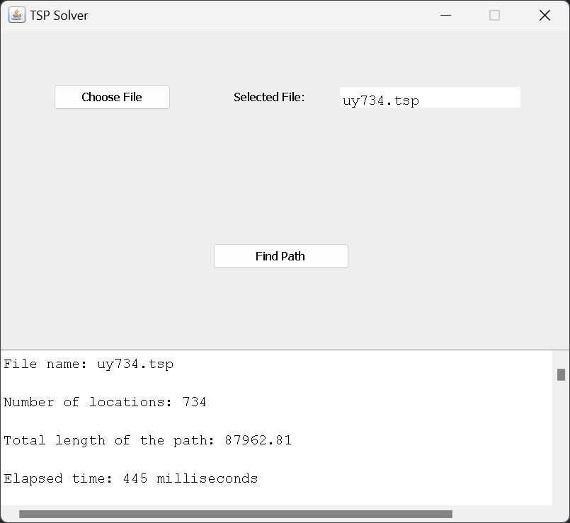

# Solving the Travelling Salesman Problem with Multiple Algorithms

## 1. Introduction
The Travelling Salesman Problem is a well-known optimization problem that aims to find the shortest possible path that visits a set of locations exactly once and returns to the starting point. This project implements three algorithms to solve the TSP: Divide and Conquer, Greedy, and Nearest Neighbour. The application allows users to select a file containing the locations and choose one of these algorithms to compute the shortest path. The result is displayed both as text and graphical visualisation, showing the optimal or near-optimal path found by the algorithm.

## 2. Problem Definition
Given a set of 734 locations (in this case, the "UY734" TSP instance from Uruguay), the objective is to minimize the total distance traveled by the salesman while visiting each location exactly once and returning to the starting point.

The optimal solution for this dataset is known to have a total path length of 79,114 as referenced from the University of Waterloo's TSP instance page.

## 3. User Interaction
The user interface provides the following features:
- **File Selection**: Users can choose a `.tsp` file that contains the locations to be visited.
- **Algorithm Selection**: The user can select one of the following algorithms:
  1. Divide and Conquer
  2. Greedy
  3. Nearest Neighbour
- **Find Path**: After selecting the file and algorithm, the user clicks the 'Find Path' button. The application then processes the data and displays the optimal or approximate path and the order of locations visited.
- **Text Box Output**: The text box at the bottom of the application displays the output, including the order of locations in the path.

The application outputs:
1. The order of the locations in the path (shown in a text box and saved in a `.txt` file). You can find the corresponding files for each algorithm: Divide and Conquer, Greedy, and Nearest Neighbour.
2. The graphical visualisation of the path (displayed in a window).
3. The all locations view: Regardless of the algorithm used, the app also displays a view of all the locations in the provided file.

### UI of the application:

All the locations used in the TSP instance provided in the "UY734" file are shown in the visualisation below:

## 4. Algorithms Implemented

### 4.1 Nearest Neighbour Algorithm
**Definition**: The Nearest Neighbour algorithm selects a starting location and iteratively visits the nearest unvisited location. It continues this process until all locations are visited, and finally returns to the starting point. This heuristic is simple and fast but tends to produce suboptimal solutions because it only considers local proximity and not the global structure of the problem.
- **Accuracy**: The Nearest Neighbour algorithm produced a path with a length of 100,919.82 which is 27.45% more than the optimal path.
- **Speed**: It was the fastest algorithm, completing the calculation in 3 milliseconds.

Check the `nearest_neighbour_output.txt` file to see the order of locations.

### 4.2 Greedy Algorithm
**Definition**: The Greedy Algorithm constructs the solution by iteratively selecting the shortest available connection between any two unconnected points. It begins by creating segments from each individual location and continuously merges the closest segments until a single path is formed. This local optimization strategy does not guarantee an optimal global solution but is efficient in terms of speed.
- **Accuracy**: The Greedy algorithm resulted in a path length of 92,208.98 which is 16.55% more than the optimal path.
- **Speed**: It completed the calculation in 721 milliseconds.

Check the `greedy_output.txt` file to see the order of locations.

### 4.3 Divide and Conquer
**Definition**: The Divide and Conquer algorithm recursively divides the set of locations into smaller subproblems. When a subproblem has six or fewer locations, an exhaustive search is applied to determine the shortest possible path. For larger subsets, locations are sorted, and paths are merged using a combination of the smallest distances between the divided paths. This merging process aims to minimize the distance between the split halves of the route. This hybrid approach, combining exhaustive search and merging, is computationally intensive.
- **Accuracy**: The Divide and Conquer algorithm yielded a path length of 125,882.29 which is 59.06% more than the optimal path.
- **Speed**: It required 2745 milliseconds to complete.

Check the `divide_and_conquer_output.txt` file to see the order of locations.

## 5. Conclusion
This project demonstrates three approaches to solving the TSP:
- The Nearest Neighbour algorithm was the fastest but produced a less optimal path compared to the Greedy Algorithm.
- The Greedy Algorithm provided a good balance of speed and accuracy, making it the most suitable for practical use in this scenario.
- The Divide and Conquer method, though powerful for small datasets, was the least effective in terms of accuracy and speed for this dataset.

Future improvements could involve integrating optimization techniques such as 2-opt or simulated annealing to improve the accuracy of heuristic-based algorithms.
